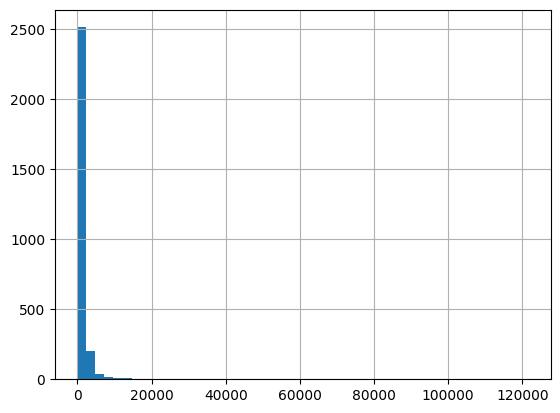
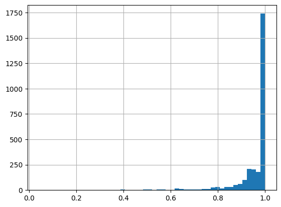
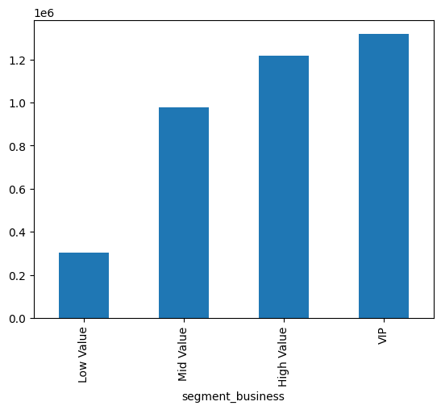

# Customer Lifetime Value Prediction using BG/NBD and Gamma-Gamma Models

## Project Overview

Customer Lifetime Value (CLV) is one of the most valuable metrics for understanding the long-term profitability of customers.

In this project, probabilistic models were applied to predict future customer purchasing behavior, estimate Customer Lifetime Value (CLV), identify customers at risk of churn, and generate actionable business recommendations.

The analysis was performed using the **Online Retail** dataset and the **Lifetimes** Python library.

---

## Business Problem

Companies often invest the same marketing effort across all customers, even though their future value differs significantly.

This project aims to answer the following business questions:

- Which customers are expected to generate the highest future revenue?
- Which customers are at risk of churning?
- How can customers be segmented according to their future value?
- Which marketing strategies should be prioritized for each customer segment?

---

## Dataset

**Online Retail Dataset**

- 541,909 transactions
- 4,372 unique customers
- UK-based online retail company
- Observation period: December 2010 – December 2011

---

## Technologies

- Python
- Pandas
- NumPy
- Matplotlib
- Seaborn
- Lifetimes

---

## Project Workflow

- Data Cleaning
- Exploratory Data Analysis (EDA)
- RFM Feature Engineering
- BG/NBD Model
- Gamma-Gamma Model
- Customer Lifetime Value Prediction
- Customer Segmentation
- Business Recommendations

---

## Main Results

The project successfully:

- Predicted the expected number of future purchases for every customer.
- Estimated the probability that each customer remains active.
- Calculated Customer Lifetime Value (CLV) over a six-month horizon.
- Segmented customers according to their predicted business value.
- Identified high-value customers at risk of churn.

---

# Project Visualizations

## Customer Lifetime Value Distribution

The CLV distribution is highly right-skewed. Most customers generate relatively low lifetime value, while a small group contributes exceptionally high future revenue.



---

## Probability of Remaining Active

The BG/NBD model estimates the probability that each customer is still active. Most customers show a high probability of remaining active, while a smaller group is identified as having a higher risk of churn.



---

## Total Customer Lifetime Value by Segment

Although VIP customers represent only a small fraction of the customer base, they contribute a disproportionately large share of the expected future revenue.



---

## Business Insights

Key findings include:

- Most customers generate relatively low lifetime value.
- A small group of VIP customers contributes a disproportionately large share of future revenue.
- Purchase frequency and average spending increase consistently across customer segments.
- Most customers have a high probability of remaining active.
- High-value customers at risk of churn should be prioritized through personalized retention strategies.

---

## Business Recommendations

### VIP Customers

- Exclusive loyalty programs
- Personalized communication
- Premium customer support
- Early access to promotions

### High Value Customers

- Cross-selling strategies
- Upselling campaigns
- Personalized product recommendations

### Potential Customers

- Marketing campaigns
- Product recommendations
- Promotions to increase purchase frequency

### Low Value Customers

- Reactivation campaigns
- Automated email marketing
- Low-cost promotional strategies

---

## Repository Structure

```text
customer-lifetime-value-prediction/
│
├── data/
│   └── Online Retail.xlsx
│
├── notebooks/
│   └── Customer_Lifetime_Value_Prediction.ipynb
│
├── images/
│   ├── clv_distribution.png
│   ├── probability_alive.png
│   └── segment_clv.png
│
├── README.md
├── requirements.txt
└── .gitignore
```

---

## Future Improvements

Potential extensions of this project include:

- Building an interactive Power BI dashboard.
- Deploying the model using Streamlit.
- Automating monthly CLV predictions.
- Comparing probabilistic models with Machine Learning approaches.

---

## Author

**Leidy Jaramillo**

Data Analyst | Python | SQL | Power BI | Data Science
LinkedIn: *https://www.linkedin.com/in/leidy-viviana-jaramillo-parra-1987a0153/*
